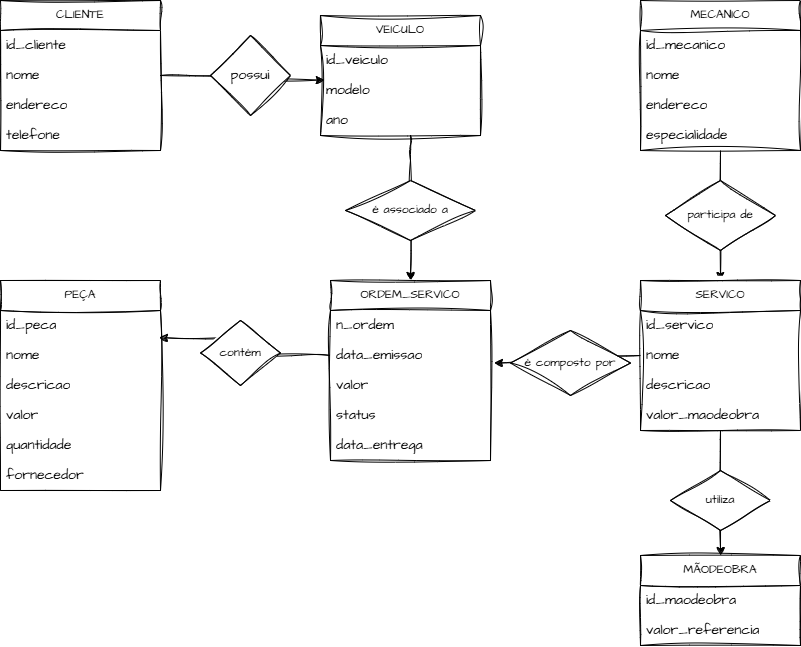

# primeiro-desafio-dio

## Modelo Conceitual de um sistema de gerenciamnto de ordens de serviço para oficina:

Para esse modelo conceitual de banco de dados foi pensada na seguinte narrativa de um sistema de controle e gerenciamento de execução de ordens de serviço em uma oficina mecânica:
- Clientes levam veículos à oficina mecânica para serem consertados ou para passarem por revisões periódicas
- Cada veículo é designado para uma equipe de mecânicos que identifica os serviços a serem executados e preenche uma OS(Ordem de Serviço) com data de entrega
- A partir da OS, calcula-se  o valor de cada serviço, consultando-se em uma tabela de referência de mão de obra 
- o valor de cada peça também irá compor a OS 
- o cliente autoriza a execução dos serviçoes
- a mesma equipe avalia e executa os serviços
- os mecânicos possuem código, nome, endereço e especialidade
- cada os possui nº, data de emissão, um valor, status e uma data para conclusão dos trabalhos
